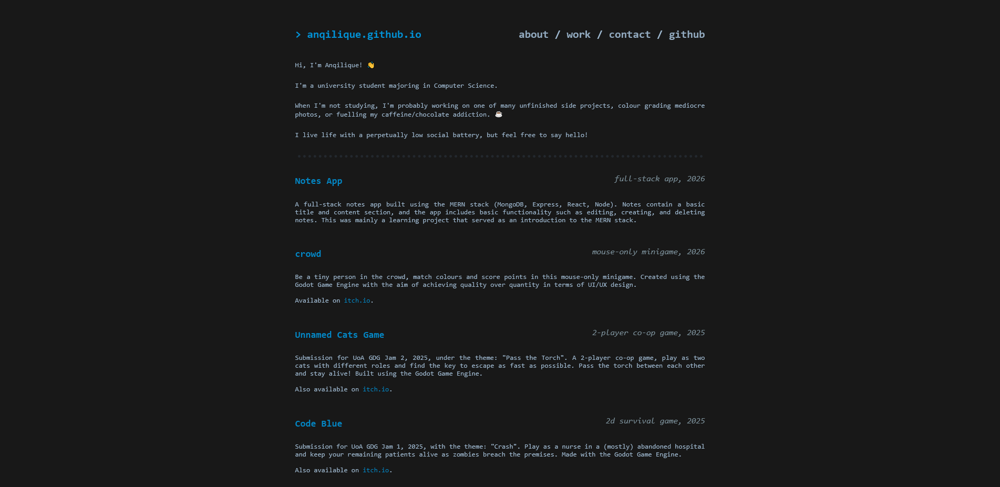

# [anqilique.github.io](https://anqilique.github.io/)
_Clean and simple personal website._

- Contains an about, work, and contact/links section.
- Switches to a linktree-style page when detecting a smaller screen size.

### Built With...

### Future Work
- [ ] Actual responsive design
- [ ] Ability to toggle/select different themes
- [ ] A nicer title and icon to display in the tab
- [ ] Scroll progress bar (just because it's fancy)
- [ ] Random flavour text (because fun)
- [ ] Some kind of gamification (✨)

## Website Preview

